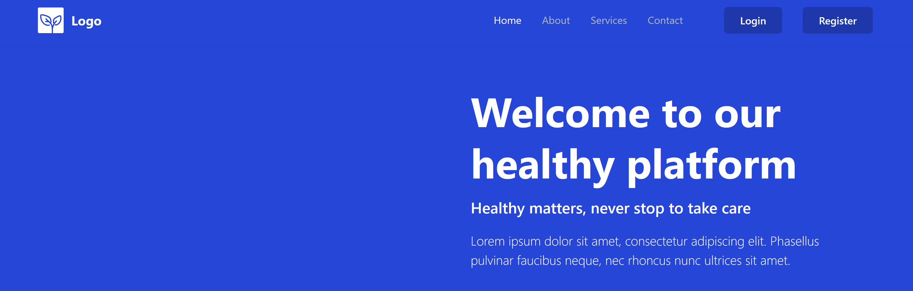

# Laravel 11 Starter Kit with Bootstrap 5 and Vue 3


## Introduction

This is a starter kit for Laravel 11, pre-configured with Bootstrap 5 for responsive design and Vue 3 for building modern, interactive web applications. It provides a solid foundation for building web applications with a focus on ease of use and developer productivity.

## Features

- **Laravel 11**: Latest version of the popular PHP framework.
- **Bootstrap 5**: Integrated for responsive and mobile-first web development.
- **Vue 3**: Set up for building dynamic and reactive user interfaces.
- **Authentication**: Pre-configured authentication system, including two-factor authentication (2FA) with Google Authenticator.
- **Social Authentication**: Integrated with Laravel Socialite for authentication via Google and Facebook.
- **Routing and State Management**: Vue Router for seamless page transitions and Pinia for efficient and scalable state management.
- **Environment**: Ready for local development with Vite for asset compilation.

## Screenshots

Here is a preview of the application:



For more screenshots, please visit the [`screenshots`](screenshots) directory in this repository.

## Getting Started

### Prerequisites

Ensure you have the following installed on your local machine:

- PHP >= 8.2
- Composer
- Node.js & npm
- Git

### Installation

1. **Clone the repository:**

    ```bash
    git clone https://github.com/ggrande4/laravel11-bootstrap5-vue3-starter-kit.git
    cd laravel-vue-bootstrap-starter-kit
    ```

2. **Install PHP dependencies:**

    ```bash
    composer install
    ```

3. **Generate application key:**

   After installing PHP dependencies, generate the application key.

    ```bash
    php artisan key:generate
    ```

4. **Install Node.js dependencies:**

    ```bash
    npm install
    ```

5. **Environment setup:**

   Copy the `.env.example` file to `.env` and configure your environment variables, especially the database settings.

    ```bash
    cp .env.example .env
    ```

   **Note**: By default, the email driver is set to `log` in the `.env.example` file. This means that any emails sent (such as verification emails or password reset links) will be written to the log files instead of being sent out. This is useful during development, as you can easily review the emails directly in the logs without setting up a mail server.

6. **Database setup:**

   Run the migrations to set up the database.

    ```bash
    php artisan migrate
    ```

7. **Compile assets:**

   Compile the frontend assets using Vite.

    ```bash
    npm run dev
    ```

8. **Run the application:**

   Start the Laravel development server.

    ```bash
    php artisan serve
    ```

   Visit `http://localhost:8000` in your browser.

## Usage

- **Authentication**: The default authentication system is set up. Visit `/register` to create a new user account and explore the authentication features, including 2FA and social login. To enable email verification, make sure that your `App\Models\User` model implements the `Illuminate\Contracts\Auth\MustVerifyEmail` contract.
- **Vue Components and Views**: The Vue application is organized with multiple directories: layouts, components and views. You can add new Vue components in these directories, with the `views` directory being the primary location for page-level components connected to routes.
- **Bootstrap**: The project includes Bootstrap 5, which you can customize and extend using SCSS. Custom styles can be added in the `resources/js/assets/scss/custom` directory.

## Socialite Integration

The project includes an initial setup for social authentication using Laravel Socialite, allowing users to log in via popular platforms like Google and Facebook. The core logic for this feature is located in the `App\Http\Controllers\Auth\SocialLoginController.php` file.

### Current Implementation

In its current state, the `SocialLoginController` is set up to handle the redirection to social providers and process the callback once authentication is successful. However, the implementation is incomplete, as key sections of the code are commented out and replaced with stub functionality.

#### Controller Overview

- **redirectToProvider($provider)**: This method is intended to redirect the user to the authentication provider (e.g., Google, Facebook). However, instead of using the Socialite redirection (`Socialite::driver($provider)->redirect()`), it currently redirects to a placeholder route for the callback.

- **handleProviderCallback(Request $request, $provider)**: This method processes the callback from the provider. The logic to handle the authenticated user's data (`Socialite::driver($provider)->stateless()->user()`) is commented out. Instead, a stub user is created or retrieved via the `createStubUser` method, which simply fetches or creates a user with a hardcoded email (`demo@gmail.com`).

- **createStubUser($provider)**: This method is a temporary placeholder that simulates user retrieval by returning a user from the database with a hardcoded email. This bypasses the need for real social authentication, allowing you to test other parts of the application without setting up social provider accounts.

### Why the Code is Incomplete

The current implementation is incomplete because:

1. **Provider Setup**: To fully implement Socialite, you need to set up developer accounts with the relevant social platforms (e.g., Google, Facebook) and configure callback URLs. This involves registering your application with these platforms and obtaining client IDs and secrets.

2. **Callback Configuration**: The callback URL for handling the social provider's response needs to be correctly set up both in your Laravel application and in the social platform's developer settings.

3. **User Data Handling**: The commented-out sections are placeholders for handling the user data returned by the social provider, such as their email, name, and unique provider ID. This logic needs to be reactivated and customized to securely manage user registration and login.

### Next Steps

To complete the Socialite integration:

1. **Set Up Provider Accounts**: Create developer accounts with the social platforms you wish to support (Google, Facebook, etc.) and configure your callback URLs.

2. **Update the Controller**: Replace the stub functionality with actual Socialite calls, ensuring that user data is correctly processed and stored.

3. **Test the Flow**: After setting up the provider accounts and updating the controller, thoroughly test the social authentication flow to ensure it works as expected.

By completing these steps, you will enable fully functional social authentication in your application, allowing users to log in via their preferred social platforms.

## Two-Factor Authentication (2FA)

The project includes support for Two-Factor Authentication (2FA) to enhance account security. By default, 2FA is disabled, but users can enable it after their first login.

### How 2FA Works

1. **Enabling 2FA**:
    - After logging in for the first time, users can enable 2FA by navigating to the account management section, accessible from the user menu in the top right corner of the page.
    - To enable 2FA, users will be prompted to scan a QR code using Google Authenticator or any other app that supports the TOTP (Time-based One-Time Password) protocol.
    - Once the QR code is scanned, the app will start generating one-time passwords (OTPs) that are required for the second step of the login process.

2. **Using 2FA During Login**:
    - When 2FA is enabled, after successfully entering the username and password during login, users will be asked to provide the OTP generated by their authenticator app.
    - The OTP is a time-sensitive code that must be entered into the appropriate input field to complete the login process.

3. **Disabling 2FA**:
    - Users have the option to disable 2FA at any time. This can be done from the same account management section where 2FA was originally enabled.

### Key Points to Remember

- **Security**: 2FA significantly increases the security of your account by requiring an additional verification step beyond just the username and password.
- **Flexibility**: Users can choose whether to enable or disable 2FA based on their personal security needs.
- **Compatibility**: 2FA is compatible with a wide range of authenticator apps, including Google Authenticator, Authy, and others that support the TOTP protocol.

Enabling 2FA is highly recommended for users who want to add an extra layer of protection to their accounts.

## Application Structure

The application is composed of two main parts:

1. **Public Area**: This is the landing page that is accessible to all visitors.
2. **Protected Area**: This is the backend area that is accessible only to logged-in users.

Both the public area and the backend are built as Single Page Applications (SPAs) using Vue.js, providing a smooth and dynamic user experience. However, the authentication logic is handled outside of Vue, using Laravel's Blade templates and built-in authentication features.

### Why This Approach is Beneficial

- **Robust Authentication**: Laravel's authentication system is well-established and highly secure. By using Blade views for login, registration, and other authentication-related processes, we leverage Laravel's mature handling of authentication, which includes session management, CSRF (Cross-Site Request Forgery) protection, and input validation. This ensures that the most sensitive parts of the application, like user login and registration, are protected by Laravel's proven security features.

- **Session Management**: Laravel's session management is tightly integrated with its authentication system, ensuring that user sessions are handled securely and efficiently. This reduces the complexity of managing authentication within the SPA and ensures consistency across the application.

- **CSRF Protection**: CSRF tokens are automatically generated and verified by Laravel during form submissions. By handling authentication outside of the Vue SPA, we avoid the challenges of managing CSRF tokens manually within the SPA framework, thus maintaining a high level of security with minimal effort.

- **Separation of Concerns**: By separating the SPA logic from the authentication process, we keep the authentication logic clean and maintainable within Laravel's ecosystem. This separation also simplifies the Vue.js codebase, allowing it to focus solely on the frontend functionality without worrying about authentication intricacies.

### Potential Drawbacks of the Mixed Approach

- **Page Load Latency**: Since the authentication pages (like login and registration) are rendered using Blade templates outside of the SPA, users may experience a slight latency when these pages are loaded. This is because the page is fully reloaded, unlike in a pure SPA where transitions are typically instant.

- **Inconsistent User Experience**: The shift from a Blade-rendered page to a Vue.js SPA can create a noticeable difference in the user experience, as the transition between the authentication process and the rest of the application might not be as seamless as in a fully integrated SPA.

- **Complexity in State Management**: Managing state between the Blade views and the Vue.js SPA can introduce additional complexity, especially when trying to maintain a consistent user session or when handling edge cases where the user's authentication state might change (e.g., session expiration).

### Summary

This hybrid approach combines the strengths of Laravel's backend capabilities with the dynamic, responsive user experience provided by Vue.js. It ensures that the application remains secure, leveraging Laravel's robust authentication features while still delivering a modern SPA experience in both the public and protected areas of the application. However, it does come with some trade-offs, such as potential latency during page loads and a less seamless user experience compared to a fully integrated SPA.

## License

This project is licensed under the MIT License - see the [LICENSE](LICENSE) file for details.

## Acknowledgements

- [Laravel](https://laravel.com/)
- [Bootstrap](https://getbootstrap.com/)
- [Vue.js](https://vuejs.org/)
